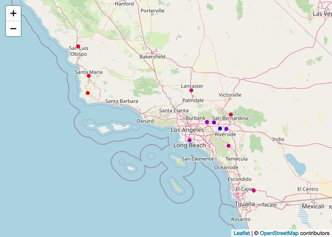

Homework2
================
Chen Chen 6381370662
2022-10-07

``` r
library(lubridate)
```

    ## 
    ## Attaching package: 'lubridate'

    ## The following objects are masked from 'package:base':
    ## 
    ##     date, intersect, setdiff, union

``` r
library(tidyverse)
```

    ## ── Attaching packages
    ## ───────────────────────────────────────
    ## tidyverse 1.3.2 ──

    ## ✔ ggplot2 3.3.6     ✔ purrr   0.3.4
    ## ✔ tibble  3.1.8     ✔ dplyr   1.0.9
    ## ✔ tidyr   1.2.0     ✔ stringr 1.4.1
    ## ✔ readr   2.1.2     ✔ forcats 0.5.2
    ## ── Conflicts ────────────────────────────────────────── tidyverse_conflicts() ──
    ## ✖ lubridate::as.difftime() masks base::as.difftime()
    ## ✖ lubridate::date()        masks base::date()
    ## ✖ dplyr::filter()          masks stats::filter()
    ## ✖ lubridate::intersect()   masks base::intersect()
    ## ✖ dplyr::lag()             masks stats::lag()
    ## ✖ lubridate::setdiff()     masks base::setdiff()
    ## ✖ lubridate::union()       masks base::union()

``` r
library(data.table)
```

    ## 
    ## Attaching package: 'data.table'
    ## 
    ## The following objects are masked from 'package:dplyr':
    ## 
    ##     between, first, last
    ## 
    ## The following object is masked from 'package:purrr':
    ## 
    ##     transpose
    ## 
    ## The following objects are masked from 'package:lubridate':
    ## 
    ##     hour, isoweek, mday, minute, month, quarter, second, wday, week,
    ##     yday, year

``` r
library(dtplyr)
library(dplyr)
library(ggplot2)
```

Data Wrangling

``` r
if (!file.exists("/Users/apple/Desktop/pm566/PM566-Homework/homework 2/chs_individual.csv")){
  download.file("https://raw.githubusercontent.com/USCbiostats/data-science-data/master/01_chs/chs_individual.csv", "chs_individual.csv", method="libcurl", timeout = 60)
}
individual <- data.table::fread("/Users/apple/Desktop/pm566/PM566-Homework/homework 2/chs_individual.csv")

if (!file.exists("/Users/apple/Desktop/pm566/PM566-Homework/homework 2/chs_regional.csv")){
  download.file("https://raw.githubusercontent.com/USCbiostats/data-science-data/master/01_chs/chs_regional.csv", "chs_regional.csv", method="libcurl", timeout = 60)
}
individual <- data.table::fread("/Users/apple/Desktop/pm566/PM566-Homework/homework 2/chs_individual.csv")
regional <- data.table::fread("/Users/apple/Desktop/pm566/PM566-Homework/homework 2/chs_regional.csv")
```

``` r
data<-
  merge(
    x= individual,
    y= regional,
    by.x = "townname",
    by.y = "townname",
    all.x = TRUE,
    all.y = FALSE
  )
```

1.  After merging the data, make sure you don’t have any duplicates by
    counting the number of rows. Make sure it matches.

``` r
nrow(data)
```

    ## [1] 1200

``` r
nrow(individual)
```

    ## [1] 1200

``` r
#We find that "data" and "individual" have same number of rows. There is no duplicates.
```

In the case of missing values, impute data using the average within the
variables “male” and “hispanic.”

``` r
data[ , bmi_imp := fcoalesce(bmi, mean(bmi, na.rm = TRUE)),
      by = .(male , hispanic)]
data[ , fev_imp := fcoalesce(fev, mean(fev, na.rm = TRUE)),
      by = .(male , hispanic)]
```

2.  Create a new categorical variable named “obesity_level” using the
    BMI measurement (underweight BMI\<14; normal BMI 14-22; overweight
    BMI 22-24; obese BMI\>24).

``` r
data[, 
    obesity_level := 
      case_when(bmi_imp < 14 ~ "Underweight",
                bmi_imp >= 13 & bmi_imp <22 ~ "Normal",
                bmi_imp >= 22 & bmi_imp < 24 ~ "Overweight",
                bmi_imp >24 ~"Obese")
]
head(data)
```

    ##    townname sid male race hispanic    agepft height weight      bmi asthma
    ## 1:   Alpine 835    0    W        0 10.099932    143     69 15.33749      0
    ## 2:   Alpine 838    0    O        1  9.486653    133     62 15.93183      0
    ## 3:   Alpine 839    0    M        1 10.053388    142     86 19.38649      0
    ## 4:   Alpine 840    0    W        0  9.965777    146     78 16.63283      0
    ## 5:   Alpine 841    1    W        1 10.548939    150     78 15.75758      0
    ## 6:   Alpine 842    1    M        1  9.489391    139     65 15.29189      0
    ##    active_asthma father_asthma mother_asthma wheeze hayfever allergy
    ## 1:             0             0             0      0        0       1
    ## 2:             0             0             0      0        0       0
    ## 3:             0             0             1      1        1       1
    ## 4:             0             0             0      0        0       0
    ## 5:             0             0             0      0        0       0
    ## 6:             0             0             0      1        0       0
    ##    educ_parent smoke pets gasstove      fev      fvc     mmef pm25_mass
    ## 1:           3     0    1        0 2529.276 2826.316 3406.579      8.74
    ## 2:           4    NA    1        0 1737.793 1963.545 2133.110      8.74
    ## 3:           3     1    1        0 2121.711 2326.974 2835.197      8.74
    ## 4:          NA    NA    0       NA 2466.791 2638.221 3466.464      8.74
    ## 5:           5     0    1        0 2251.505 2594.649 2445.151      8.74
    ## 6:           1     1    1        0 2188.716 2423.934 2524.599      8.74
    ##    pm25_so4 pm25_no3 pm25_nh4 pm25_oc pm25_ec pm25_om pm10_oc pm10_ec pm10_tc
    ## 1:     1.73     1.59     0.88    2.54    0.48    3.04    3.25    0.49    3.75
    ## 2:     1.73     1.59     0.88    2.54    0.48    3.04    3.25    0.49    3.75
    ## 3:     1.73     1.59     0.88    2.54    0.48    3.04    3.25    0.49    3.75
    ## 4:     1.73     1.59     0.88    2.54    0.48    3.04    3.25    0.49    3.75
    ## 5:     1.73     1.59     0.88    2.54    0.48    3.04    3.25    0.49    3.75
    ## 6:     1.73     1.59     0.88    2.54    0.48    3.04    3.25    0.49    3.75
    ##    formic acetic  hcl hno3 o3_max o3106 o3_24   no2  pm10 no_24hr pm2_5_fr
    ## 1:   1.03   2.49 0.41 1.98  65.82 55.05 41.23 12.18 24.73    2.48    10.28
    ## 2:   1.03   2.49 0.41 1.98  65.82 55.05 41.23 12.18 24.73    2.48    10.28
    ## 3:   1.03   2.49 0.41 1.98  65.82 55.05 41.23 12.18 24.73    2.48    10.28
    ## 4:   1.03   2.49 0.41 1.98  65.82 55.05 41.23 12.18 24.73    2.48    10.28
    ## 5:   1.03   2.49 0.41 1.98  65.82 55.05 41.23 12.18 24.73    2.48    10.28
    ## 6:   1.03   2.49 0.41 1.98  65.82 55.05 41.23 12.18 24.73    2.48    10.28
    ##    iacid oacid total_acids       lon      lat  bmi_imp  fev_imp obesity_level
    ## 1:  2.39  3.52         5.5 -116.7664 32.83505 15.33749 2529.276        Normal
    ## 2:  2.39  3.52         5.5 -116.7664 32.83505 15.93183 1737.793        Normal
    ## 3:  2.39  3.52         5.5 -116.7664 32.83505 19.38649 2121.711        Normal
    ## 4:  2.39  3.52         5.5 -116.7664 32.83505 16.63283 2466.791        Normal
    ## 5:  2.39  3.52         5.5 -116.7664 32.83505 15.75758 2251.505        Normal
    ## 6:  2.39  3.52         5.5 -116.7664 32.83505 15.29189 2188.716        Normal

To make sure the variable is rightly coded, create a summary table that
contains the minimum BMI, maximum BMI, and the total number of
observations per category.

``` r
data%>%
group_by(obesity_level)%>%
summarise(
  min_bmi = min(bmi_imp, na.rm = TRUE),
  max_bmi = max(bmi_imp, na.rm = TRUE),
  total_obs = n()) %>%
knitr::kable()
```

| obesity_level |  min_bmi |  max_bmi | total_obs |
|:--------------|---------:|---------:|----------:|
| Normal        | 14.00380 | 21.96387 |       975 |
| Obese         | 24.00647 | 41.26613 |       103 |
| Overweight    | 22.02353 | 23.99650 |        87 |
| Underweight   | 11.29640 | 13.98601 |        35 |

3.  Create another categorical variable named “smoke_gas_exposure” that
    summarizes “Second Hand Smoke” and “Gas Stove.” The variable should
    have four categories in total.

``` r
data[, 
    smoke_gas_exposure := 
      case_when(smoke == 0 & gasstove == 0 ~ "no exposure",
                smoke == 1 & gasstove == 0  ~ "smoke exposure",
                smoke == 0 & gasstove == 1 ~ "gas exposure",
                smoke == 1 & gasstove == 1 ~ "both exposure")
]
head(data)
```

    ##    townname sid male race hispanic    agepft height weight      bmi asthma
    ## 1:   Alpine 835    0    W        0 10.099932    143     69 15.33749      0
    ## 2:   Alpine 838    0    O        1  9.486653    133     62 15.93183      0
    ## 3:   Alpine 839    0    M        1 10.053388    142     86 19.38649      0
    ## 4:   Alpine 840    0    W        0  9.965777    146     78 16.63283      0
    ## 5:   Alpine 841    1    W        1 10.548939    150     78 15.75758      0
    ## 6:   Alpine 842    1    M        1  9.489391    139     65 15.29189      0
    ##    active_asthma father_asthma mother_asthma wheeze hayfever allergy
    ## 1:             0             0             0      0        0       1
    ## 2:             0             0             0      0        0       0
    ## 3:             0             0             1      1        1       1
    ## 4:             0             0             0      0        0       0
    ## 5:             0             0             0      0        0       0
    ## 6:             0             0             0      1        0       0
    ##    educ_parent smoke pets gasstove      fev      fvc     mmef pm25_mass
    ## 1:           3     0    1        0 2529.276 2826.316 3406.579      8.74
    ## 2:           4    NA    1        0 1737.793 1963.545 2133.110      8.74
    ## 3:           3     1    1        0 2121.711 2326.974 2835.197      8.74
    ## 4:          NA    NA    0       NA 2466.791 2638.221 3466.464      8.74
    ## 5:           5     0    1        0 2251.505 2594.649 2445.151      8.74
    ## 6:           1     1    1        0 2188.716 2423.934 2524.599      8.74
    ##    pm25_so4 pm25_no3 pm25_nh4 pm25_oc pm25_ec pm25_om pm10_oc pm10_ec pm10_tc
    ## 1:     1.73     1.59     0.88    2.54    0.48    3.04    3.25    0.49    3.75
    ## 2:     1.73     1.59     0.88    2.54    0.48    3.04    3.25    0.49    3.75
    ## 3:     1.73     1.59     0.88    2.54    0.48    3.04    3.25    0.49    3.75
    ## 4:     1.73     1.59     0.88    2.54    0.48    3.04    3.25    0.49    3.75
    ## 5:     1.73     1.59     0.88    2.54    0.48    3.04    3.25    0.49    3.75
    ## 6:     1.73     1.59     0.88    2.54    0.48    3.04    3.25    0.49    3.75
    ##    formic acetic  hcl hno3 o3_max o3106 o3_24   no2  pm10 no_24hr pm2_5_fr
    ## 1:   1.03   2.49 0.41 1.98  65.82 55.05 41.23 12.18 24.73    2.48    10.28
    ## 2:   1.03   2.49 0.41 1.98  65.82 55.05 41.23 12.18 24.73    2.48    10.28
    ## 3:   1.03   2.49 0.41 1.98  65.82 55.05 41.23 12.18 24.73    2.48    10.28
    ## 4:   1.03   2.49 0.41 1.98  65.82 55.05 41.23 12.18 24.73    2.48    10.28
    ## 5:   1.03   2.49 0.41 1.98  65.82 55.05 41.23 12.18 24.73    2.48    10.28
    ## 6:   1.03   2.49 0.41 1.98  65.82 55.05 41.23 12.18 24.73    2.48    10.28
    ##    iacid oacid total_acids       lon      lat  bmi_imp  fev_imp obesity_level
    ## 1:  2.39  3.52         5.5 -116.7664 32.83505 15.33749 2529.276        Normal
    ## 2:  2.39  3.52         5.5 -116.7664 32.83505 15.93183 1737.793        Normal
    ## 3:  2.39  3.52         5.5 -116.7664 32.83505 19.38649 2121.711        Normal
    ## 4:  2.39  3.52         5.5 -116.7664 32.83505 16.63283 2466.791        Normal
    ## 5:  2.39  3.52         5.5 -116.7664 32.83505 15.75758 2251.505        Normal
    ## 6:  2.39  3.52         5.5 -116.7664 32.83505 15.29189 2188.716        Normal
    ##    smoke_gas_exposure
    ## 1:        no exposure
    ## 2:               <NA>
    ## 3:     smoke exposure
    ## 4:               <NA>
    ## 5:        no exposure
    ## 6:     smoke exposure

4.  Create four summary tables showing the average (or proportion, if
    binary) and sd of “Forced expiratory volume in 1 second (ml)” and
    asthma indicator by town, sex, obesity level, and
    “smoke_gas_exposure.”

``` r
data[ , .(
  avg_fev1 = mean(fev_imp, na.rm= TRUE),
  sd_fev1 = sd(fev_imp, na.rm = TRUE),
  percent_asthma = sum(asthma, na.rm = TRUE)/sum(!is.na(asthma))),
  by = townname][order(townname)]%>% head(n=10)
```

    ##          townname avg_fev1  sd_fev1 percent_asthma
    ##  1:        Alpine 2087.101 291.1768      0.1134021
    ##  2:    Atascadero 2075.897 324.0935      0.2551020
    ##  3: Lake Elsinore 2038.849 303.6956      0.1263158
    ##  4:  Lake Gregory 2084.700 319.9593      0.1515152
    ##  5:     Lancaster 2003.044 317.1298      0.1649485
    ##  6:        Lompoc 2034.354 351.0454      0.1134021
    ##  7:    Long Beach 1985.861 319.4625      0.1354167
    ##  8:     Mira Loma 1985.202 324.9634      0.1578947
    ##  9:     Riverside 1989.881 277.5065      0.1100000
    ## 10:     San Dimas 2026.794 318.7845      0.1717172

``` r
data[ , .(
  avg_fev1 = mean(fev_imp, na.rm= TRUE),
  sd_fev1 = sd(fev_imp, na.rm = TRUE),
  percent_asthma = sum(asthma, na.rm = TRUE)/sum(!is.na(asthma))),
  by = male][order(male)]%>% head(n=10)
```

    ##    male avg_fev1  sd_fev1 percent_asthma
    ## 1:    0 1958.911 311.9181      0.1208054
    ## 2:    1 2103.787 307.5123      0.1727749

``` r
data[ , .(
  avg_fev1 = mean(fev_imp, na.rm= TRUE),
  sd_fev1 = sd(fev_imp, na.rm = TRUE),
  percent_asthma = sum(asthma, na.rm = TRUE)/sum(!is.na(asthma))),
  by = obesity_level][order(obesity_level)]%>% head(n=10)
```

    ##    obesity_level avg_fev1  sd_fev1 percent_asthma
    ## 1:        Normal 1999.794 295.1964     0.14014752
    ## 2:         Obese 2266.154 325.4710     0.21000000
    ## 3:    Overweight 2224.322 317.4261     0.16470588
    ## 4:   Underweight 1698.327 303.3983     0.08571429

``` r
data[ , .(
  avg_fev1 = mean(fev_imp, na.rm= TRUE),
  sd_fev1 = sd(fev_imp, na.rm = TRUE),
  percent_asthma = sum(asthma, na.rm = TRUE)/sum(!is.na(asthma))),
  by = smoke_gas_exposure][order(smoke_gas_exposure)]%>% head(n=10)
```

    ##    smoke_gas_exposure avg_fev1  sd_fev1 percent_asthma
    ## 1:      both exposure 2019.867 298.9728      0.1301370
    ## 2:       gas exposure 2025.989 317.6305      0.1477428
    ## 3:        no exposure 2055.356 330.4169      0.1476190
    ## 4:     smoke exposure 2055.714 295.6475      0.1714286
    ## 5:               <NA> 2001.878 340.2592      0.1489362

Looking at the Data (EDA) The primary questions of interest are: 1. What
is the association between BMI and FEV (forced expiratory volume)? 2.
What is the association between smoke and gas exposure and FEV? 3. What
is the association between PM2.5 exposure and FEV?

Follow the EDA checklist from week 3 and the previous assignment. Be
sure to focus on the key variables.

``` r
#check the dimensions, headers, footers, variable names and variable types
dim(data)
```

    ## [1] 1200   53

``` r
head(data)
```

    ##    townname sid male race hispanic    agepft height weight      bmi asthma
    ## 1:   Alpine 835    0    W        0 10.099932    143     69 15.33749      0
    ## 2:   Alpine 838    0    O        1  9.486653    133     62 15.93183      0
    ## 3:   Alpine 839    0    M        1 10.053388    142     86 19.38649      0
    ## 4:   Alpine 840    0    W        0  9.965777    146     78 16.63283      0
    ## 5:   Alpine 841    1    W        1 10.548939    150     78 15.75758      0
    ## 6:   Alpine 842    1    M        1  9.489391    139     65 15.29189      0
    ##    active_asthma father_asthma mother_asthma wheeze hayfever allergy
    ## 1:             0             0             0      0        0       1
    ## 2:             0             0             0      0        0       0
    ## 3:             0             0             1      1        1       1
    ## 4:             0             0             0      0        0       0
    ## 5:             0             0             0      0        0       0
    ## 6:             0             0             0      1        0       0
    ##    educ_parent smoke pets gasstove      fev      fvc     mmef pm25_mass
    ## 1:           3     0    1        0 2529.276 2826.316 3406.579      8.74
    ## 2:           4    NA    1        0 1737.793 1963.545 2133.110      8.74
    ## 3:           3     1    1        0 2121.711 2326.974 2835.197      8.74
    ## 4:          NA    NA    0       NA 2466.791 2638.221 3466.464      8.74
    ## 5:           5     0    1        0 2251.505 2594.649 2445.151      8.74
    ## 6:           1     1    1        0 2188.716 2423.934 2524.599      8.74
    ##    pm25_so4 pm25_no3 pm25_nh4 pm25_oc pm25_ec pm25_om pm10_oc pm10_ec pm10_tc
    ## 1:     1.73     1.59     0.88    2.54    0.48    3.04    3.25    0.49    3.75
    ## 2:     1.73     1.59     0.88    2.54    0.48    3.04    3.25    0.49    3.75
    ## 3:     1.73     1.59     0.88    2.54    0.48    3.04    3.25    0.49    3.75
    ## 4:     1.73     1.59     0.88    2.54    0.48    3.04    3.25    0.49    3.75
    ## 5:     1.73     1.59     0.88    2.54    0.48    3.04    3.25    0.49    3.75
    ## 6:     1.73     1.59     0.88    2.54    0.48    3.04    3.25    0.49    3.75
    ##    formic acetic  hcl hno3 o3_max o3106 o3_24   no2  pm10 no_24hr pm2_5_fr
    ## 1:   1.03   2.49 0.41 1.98  65.82 55.05 41.23 12.18 24.73    2.48    10.28
    ## 2:   1.03   2.49 0.41 1.98  65.82 55.05 41.23 12.18 24.73    2.48    10.28
    ## 3:   1.03   2.49 0.41 1.98  65.82 55.05 41.23 12.18 24.73    2.48    10.28
    ## 4:   1.03   2.49 0.41 1.98  65.82 55.05 41.23 12.18 24.73    2.48    10.28
    ## 5:   1.03   2.49 0.41 1.98  65.82 55.05 41.23 12.18 24.73    2.48    10.28
    ## 6:   1.03   2.49 0.41 1.98  65.82 55.05 41.23 12.18 24.73    2.48    10.28
    ##    iacid oacid total_acids       lon      lat  bmi_imp  fev_imp obesity_level
    ## 1:  2.39  3.52         5.5 -116.7664 32.83505 15.33749 2529.276        Normal
    ## 2:  2.39  3.52         5.5 -116.7664 32.83505 15.93183 1737.793        Normal
    ## 3:  2.39  3.52         5.5 -116.7664 32.83505 19.38649 2121.711        Normal
    ## 4:  2.39  3.52         5.5 -116.7664 32.83505 16.63283 2466.791        Normal
    ## 5:  2.39  3.52         5.5 -116.7664 32.83505 15.75758 2251.505        Normal
    ## 6:  2.39  3.52         5.5 -116.7664 32.83505 15.29189 2188.716        Normal
    ##    smoke_gas_exposure
    ## 1:        no exposure
    ## 2:               <NA>
    ## 3:     smoke exposure
    ## 4:               <NA>
    ## 5:        no exposure
    ## 6:     smoke exposure

``` r
tail(data)
```

    ##    townname  sid male race hispanic    agepft height weight      bmi asthma
    ## 1:   Upland 1866    0    O        1  9.806982    139     60 14.11559      0
    ## 2:   Upland 1867    0    M        1  9.618070    140     71 16.46568      0
    ## 3:   Upland 2031    1    W        0  9.798768    135     83 20.70084      0
    ## 4:   Upland 2032    1    W        0  9.549624    137     59 14.28855      0
    ## 5:   Upland 2033    0    M        0 10.121834    130     67 18.02044      0
    ## 6:   Upland 2053    0    W        0        NA     NA     NA       NA      0
    ##    active_asthma father_asthma mother_asthma wheeze hayfever allergy
    ## 1:             0            NA             0      0       NA      NA
    ## 2:             0             1             0      0        0       0
    ## 3:             0             0             0      1        0       1
    ## 4:             0             0             1      1        1       1
    ## 5:             1             0             0      1        1       0
    ## 6:             0             0             0      0        0       0
    ##    educ_parent smoke pets gasstove      fev      fvc     mmef pm25_mass
    ## 1:           3     0    1        0 1691.275 1928.859 1890.604     22.46
    ## 2:           3     0    1        0 1733.338 1993.040 2072.643     22.46
    ## 3:           3     0    1        1 2034.177 2505.535 1814.075     22.46
    ## 4:           3     0    1        1 2077.703 2275.338 2706.081     22.46
    ## 5:           3     0    1        1 1929.866 2122.148 2558.054     22.46
    ## 6:           3     0    1        0       NA       NA       NA     22.46
    ##    pm25_so4 pm25_no3 pm25_nh4 pm25_oc pm25_ec pm25_om pm10_oc pm10_ec pm10_tc
    ## 1:     2.65     7.75     2.96    6.49    1.19    7.79    8.32    1.22    9.54
    ## 2:     2.65     7.75     2.96    6.49    1.19    7.79    8.32    1.22    9.54
    ## 3:     2.65     7.75     2.96    6.49    1.19    7.79    8.32    1.22    9.54
    ## 4:     2.65     7.75     2.96    6.49    1.19    7.79    8.32    1.22    9.54
    ## 5:     2.65     7.75     2.96    6.49    1.19    7.79    8.32    1.22    9.54
    ## 6:     2.65     7.75     2.96    6.49    1.19    7.79    8.32    1.22    9.54
    ##    formic acetic  hcl hno3 o3_max o3106 o3_24   no2 pm10 no_24hr pm2_5_fr iacid
    ## 1:   2.67   4.73 0.46 4.03  63.83  46.5  22.2 37.97 40.8   18.48    27.73  4.49
    ## 2:   2.67   4.73 0.46 4.03  63.83  46.5  22.2 37.97 40.8   18.48    27.73  4.49
    ## 3:   2.67   4.73 0.46 4.03  63.83  46.5  22.2 37.97 40.8   18.48    27.73  4.49
    ## 4:   2.67   4.73 0.46 4.03  63.83  46.5  22.2 37.97 40.8   18.48    27.73  4.49
    ## 5:   2.67   4.73 0.46 4.03  63.83  46.5  22.2 37.97 40.8   18.48    27.73  4.49
    ## 6:   2.67   4.73 0.46 4.03  63.83  46.5  22.2 37.97 40.8   18.48    27.73  4.49
    ##    oacid total_acids       lon      lat  bmi_imp  fev_imp obesity_level
    ## 1:   7.4       11.43 -117.6484 34.09751 14.11559 1691.275        Normal
    ## 2:   7.4       11.43 -117.6484 34.09751 16.46568 1733.338        Normal
    ## 3:   7.4       11.43 -117.6484 34.09751 20.70084 2034.177        Normal
    ## 4:   7.4       11.43 -117.6484 34.09751 14.28855 2077.703        Normal
    ## 5:   7.4       11.43 -117.6484 34.09751 18.02044 1929.866        Normal
    ## 6:   7.4       11.43 -117.6484 34.09751 18.05281 1945.743        Normal
    ##    smoke_gas_exposure
    ## 1:        no exposure
    ## 2:        no exposure
    ## 3:       gas exposure
    ## 4:       gas exposure
    ## 5:       gas exposure
    ## 6:        no exposure

``` r
str(data)
```

    ## Classes 'data.table' and 'data.frame':   1200 obs. of  53 variables:
    ##  $ townname          : chr  "Alpine" "Alpine" "Alpine" "Alpine" ...
    ##  $ sid               : int  835 838 839 840 841 842 843 844 847 849 ...
    ##  $ male              : int  0 0 0 0 1 1 1 1 1 1 ...
    ##  $ race              : chr  "W" "O" "M" "W" ...
    ##  $ hispanic          : int  0 1 1 0 1 1 0 1 0 0 ...
    ##  $ agepft            : num  10.1 9.49 10.05 9.97 10.55 ...
    ##  $ height            : int  143 133 142 146 150 139 149 143 137 147 ...
    ##  $ weight            : int  69 62 86 78 78 65 98 65 69 112 ...
    ##  $ bmi               : num  15.3 15.9 19.4 16.6 15.8 ...
    ##  $ asthma            : int  0 0 0 0 0 0 0 NA 0 0 ...
    ##  $ active_asthma     : int  0 0 0 0 0 0 0 0 0 0 ...
    ##  $ father_asthma     : int  0 0 0 0 0 0 0 NA 0 1 ...
    ##  $ mother_asthma     : int  0 0 1 0 0 0 0 NA 0 0 ...
    ##  $ wheeze            : int  0 0 1 0 0 1 1 NA 0 1 ...
    ##  $ hayfever          : int  0 0 1 0 0 0 0 NA 0 0 ...
    ##  $ allergy           : int  1 0 1 0 0 0 1 NA 0 1 ...
    ##  $ educ_parent       : int  3 4 3 NA 5 1 3 NA 5 3 ...
    ##  $ smoke             : int  0 NA 1 NA 0 1 0 NA 0 0 ...
    ##  $ pets              : int  1 1 1 0 1 1 1 0 1 1 ...
    ##  $ gasstove          : int  0 0 0 NA 0 0 1 NA 1 0 ...
    ##  $ fev               : num  2529 1738 2122 2467 2252 ...
    ##  $ fvc               : num  2826 1964 2327 2638 2595 ...
    ##  $ mmef              : num  3407 2133 2835 3466 2445 ...
    ##  $ pm25_mass         : num  8.74 8.74 8.74 8.74 8.74 8.74 8.74 8.74 8.74 8.74 ...
    ##  $ pm25_so4          : num  1.73 1.73 1.73 1.73 1.73 1.73 1.73 1.73 1.73 1.73 ...
    ##  $ pm25_no3          : num  1.59 1.59 1.59 1.59 1.59 1.59 1.59 1.59 1.59 1.59 ...
    ##  $ pm25_nh4          : num  0.88 0.88 0.88 0.88 0.88 0.88 0.88 0.88 0.88 0.88 ...
    ##  $ pm25_oc           : num  2.54 2.54 2.54 2.54 2.54 2.54 2.54 2.54 2.54 2.54 ...
    ##  $ pm25_ec           : num  0.48 0.48 0.48 0.48 0.48 0.48 0.48 0.48 0.48 0.48 ...
    ##  $ pm25_om           : num  3.04 3.04 3.04 3.04 3.04 3.04 3.04 3.04 3.04 3.04 ...
    ##  $ pm10_oc           : num  3.25 3.25 3.25 3.25 3.25 3.25 3.25 3.25 3.25 3.25 ...
    ##  $ pm10_ec           : num  0.49 0.49 0.49 0.49 0.49 0.49 0.49 0.49 0.49 0.49 ...
    ##  $ pm10_tc           : num  3.75 3.75 3.75 3.75 3.75 3.75 3.75 3.75 3.75 3.75 ...
    ##  $ formic            : num  1.03 1.03 1.03 1.03 1.03 1.03 1.03 1.03 1.03 1.03 ...
    ##  $ acetic            : num  2.49 2.49 2.49 2.49 2.49 2.49 2.49 2.49 2.49 2.49 ...
    ##  $ hcl               : num  0.41 0.41 0.41 0.41 0.41 0.41 0.41 0.41 0.41 0.41 ...
    ##  $ hno3              : num  1.98 1.98 1.98 1.98 1.98 1.98 1.98 1.98 1.98 1.98 ...
    ##  $ o3_max            : num  65.8 65.8 65.8 65.8 65.8 ...
    ##  $ o3106             : num  55 55 55 55 55 ...
    ##  $ o3_24             : num  41.2 41.2 41.2 41.2 41.2 ...
    ##  $ no2               : num  12.2 12.2 12.2 12.2 12.2 ...
    ##  $ pm10              : num  24.7 24.7 24.7 24.7 24.7 ...
    ##  $ no_24hr           : num  2.48 2.48 2.48 2.48 2.48 2.48 2.48 2.48 2.48 2.48 ...
    ##  $ pm2_5_fr          : num  10.3 10.3 10.3 10.3 10.3 ...
    ##  $ iacid             : num  2.39 2.39 2.39 2.39 2.39 2.39 2.39 2.39 2.39 2.39 ...
    ##  $ oacid             : num  3.52 3.52 3.52 3.52 3.52 3.52 3.52 3.52 3.52 3.52 ...
    ##  $ total_acids       : num  5.5 5.5 5.5 5.5 5.5 5.5 5.5 5.5 5.5 5.5 ...
    ##  $ lon               : num  -117 -117 -117 -117 -117 ...
    ##  $ lat               : num  32.8 32.8 32.8 32.8 32.8 ...
    ##  $ bmi_imp           : num  15.3 15.9 19.4 16.6 15.8 ...
    ##  $ fev_imp           : num  2529 1738 2122 2467 2252 ...
    ##  $ obesity_level     : chr  "Normal" "Normal" "Normal" "Normal" ...
    ##  $ smoke_gas_exposure: chr  "no exposure" NA "smoke exposure" NA ...
    ##  - attr(*, ".internal.selfref")=<externalptr> 
    ##  - attr(*, "sorted")= chr "townname"

``` r
# Check for any data issues, particularly in the key variable we are analyzing.
table(data$bmi_imp)
```

    ## 
    ## 11.2963959117805 12.1182060545939 12.3113218351314  12.593299396006 
    ##                1                1                1                1 
    ## 12.6572024544847 12.7040290592902 12.7618963068182 12.9786884638001 
    ##                1                1                1                1 
    ##  12.987012987013 13.0072840790843 13.0436597378746 13.3167613636364 
    ##                1                1                1                1 
    ##  13.362181941525 13.3818181818182 13.3842481057192 13.4480903711673 
    ##                1                1                1                3 
    ## 13.4680134680135 13.5254549061333 13.5620147341603 13.6573960262441 
    ##                1                2                1                1 
    ## 13.6697786508435 13.7170521785906  13.717985650987 13.7733020432164 
    ##                1                1                1                1 
    ## 13.8761120161991 13.8803280462615 13.9146567717996 13.9305439467689 
    ##                2                1                1                2 
    ## 13.9668287816436  13.986013986014 14.0037965848519 14.0525348610961 
    ##                1                1                1                1 
    ## 14.0739350722462   14.08222107655 14.1155878436558 14.1271277706573 
    ##                1                1                4                2 
    ## 14.1760667490229   14.20172765144 14.2260790703257 14.2549757934373 
    ##                3                1                1                1 
    ##  14.268727705113 14.2871765127348  14.288551237776 14.3030444294939 
    ##                1                2                4                1 
    ## 14.3186798592204 14.3480257116621   14.35084764105  14.378478664193 
    ##                1                1                1                1 
    ## 14.3900420908731 14.4271518998756 14.4292107981126 14.4483615557996 
    ##                3                1                1                2 
    ## 14.4656440952737 14.4768397878187 14.4994495124253 14.5239376008607 
    ##                3                1                2                3 
    ## 14.5307300723146 14.5366097350242 14.5679156226327 14.5861074384443 
    ##                3                1                1                1 
    ## 14.6325180277195 14.6525761483111  14.654574763695 14.6706440412734 
    ##                1                1                2                1 
    ## 14.6823548472022 14.6867985409652 14.7136593937119 14.7413507172077 
    ##                2                1                1                1 
    ## 14.7452028939918 14.7499877083436 14.7729089068532 14.7810046353231 
    ##                4                1                2                2 
    ##  14.792899408284 14.7982662160356 14.8327868157715 14.8363636363636 
    ##                1                2                2                1 
    ## 14.8423005565863 14.8611511219026 14.8697721011771 14.8780003967467 
    ##                3                1                1                1 
    ## 14.9039721655472 14.9173062371635 14.9269008342005 14.9354988962919 
    ##                2                2                1                5 
    ## 14.9644594089039 14.9813565340909 14.9909562755584 15.0150877413918 
    ##                9                2                2                4 
    ## 15.0223231722339 15.0231356288685 15.0369479291975 15.0566270332328 
    ##                1                1                2                1 
    ## 15.0618612157074 15.0742115027829 15.0897842160857 15.0976580089103 
    ##                1                3                2                3 
    ## 15.1034246451822 15.1152090122211 15.1272727272727 15.1306452959345 
    ##                1                1                1                1 
    ## 15.1401422746891 15.1452046495778 15.1508326815745 15.1515151515152 
    ##                1                1                1                1 
    ## 15.1609372028842 15.1886429453816 15.2138670657189 15.2367096571249 
    ##                4                5                2                2 
    ## 15.2572665759303 15.2756296423593 15.2918868306271 15.2962835493933 
    ##                2                3                4                3 
    ## 15.3061224489796 15.3184173102688 15.3308230231307 15.3374914976949 
    ##                4                3                2                1 
    ## 15.3430309994516 15.3444163860831 15.3496919251973  15.355573663758 
    ##                1                2                3                2 
    ##  15.362529202049  15.391518490692 15.4824630386914 15.4994454104689 
    ##                2                2                4                5 
    ## 15.5143113555212 15.5271466280213 15.5362215909091 15.5470504044519 
    ##                3                2                2                2 
    ## 15.5542731420533 15.5597739831688 15.5603146459414 15.5636223344557 
    ##                1                2                1                2 
    ## 15.5637824556743 15.5659047787328 15.6232160991233 15.6274003951878 
    ##                1                1                1                1 
    ## 15.6678649134424 15.6748672775582  15.694931043561  15.712682379349 
    ##                1                2                3                3 
    ## 15.7282164202579 15.7416242450075 15.7470395565634 15.7529930686831 
    ##                3                5                1                3 
    ## 15.7575757575758 15.7624064254156 15.7756834986351 15.7796973904889 
    ##                2                7                1                1 
    ## 15.7798665961548 15.7820564686426  15.782077613231 15.7828282828283 
    ##                1                2                1                5 
    ## 15.8136541193182 15.8687466379774 15.8922715883266  15.913264880207 
    ##                2                2                2                5 
    ## 15.9318323148952 15.9480750926507 15.9482638321286 15.9620900361641 
    ##                5                2                1                2 
    ## 15.9634850061489 15.9838030795461 15.9866049078877 15.9916747818449 
    ##                2                1                1                1 
    ## 15.9931080366434 15.9976662228099 15.9982704572479 16.0018552875696 
    ##                2                2                1                3 
    ## 16.0020342312009 16.0043389541165 16.0051216389245 16.0333493666827 
    ##                1                2                2                1 
    ## 16.0636684909733 16.1377084454008 16.1571427814654 16.1616161616162 
    ##                1                2                2                1 
    ## 16.1745375924917 16.1887973522323 16.2012191417404 16.2114976929792 
    ##                1                3                2                4 
    ## 16.2144633012647  16.219723183391 16.2212401795735 16.2241090260127 
    ##                1                2                3                1 
    ## 16.2259819140846   16.23054588736 16.2329260202041 16.2329496870013 
    ##                5                2                3                5 
    ##  16.319659176802 16.3685191761364 16.3888752314929 16.4066702528241 
    ##                1                2                2                2 
    ## 16.4073050370426 16.4220139746041  16.435011269722 16.4404461279461 
    ##                2                2                1                1 
    ## 16.4457623895693 16.4489039250641 16.4543631908301 16.4609053497942 
    ##                3                4                2                3 
    ## 16.4615827811844 16.4654765649575 16.4656771799629 16.4681607486232 
    ##                2                4                7                3 
    ## 16.4681858175984 16.4690382081686 16.5547251915618 16.5840195568586 
    ##                1                5                1                1 
    ## 16.6176551016201 16.6273059818847 16.6328323581091 16.6459517045455 
    ##                2                2                1                2 
    ## 16.6468489892985 16.6620231520177  16.671186410538 16.6756320602474 
    ##                2                1                1                1 
    ## 16.6868851677429 16.6958844644795 16.6975881261596 16.7027274269063 
    ##                1                1                2                3 
    ## 16.7034456149926 16.7075072399198 16.7077199213305 16.7103395831618 
    ##                1                2                2                3 
    ## 16.7112299465241 16.7228028204482  16.745677023735 16.7648757225972 
    ##                3                1                1                1 
    ## 16.7676767676768 16.7887605390421 16.7965600644988 16.8280051661976 
    ##                2                1                1                1 
    ## 16.8630418333153 16.8727272727273 16.8788580246914 16.8922787970407 
    ##                2                1                2                1 
    ## 16.8932694884252 16.8934688960118 16.9068186326667 16.9091247273404 
    ##                1                1                5                1 
    ## 16.9188489695506 16.9294990723562 16.9351710725426 16.9450303216366 
    ##                4                4                1                1 
    ## 16.9464016344924 16.9517563608817 16.9525184177004  16.956757659237 
    ##                1                1                4                2 
    ## 16.9569833280906 16.9597206634244 16.9606512890095 17.0164021515373 
    ##                3                6                5                1 
    ## 17.0579125714899 17.0792346773322 17.0874449997864  17.098063973064 
    ##                1                2                1                1 
    ## 17.1019520656715 17.1157513814857 17.1322428811022 17.1443836195382 
    ##                1                3                1                1 
    ## 17.1474820637338 17.1614100185529 17.1739652097812 17.1850833476542 
    ##                1                1                1                3 
    ## 17.1946972522389 17.2027367096571 17.2091283202394 17.2135556750941 
    ##                3                4                3                2 
    ## 17.2166275540205 17.2166575015803 17.2176308539945 17.2239192509463 
    ##                1                2                2                1 
    ##  17.295427521349 17.3380338669595 17.3576671295378 17.3761151579169 
    ##                3                1                1                2 
    ## 17.3933209647495 17.4092250071754 17.4237650608161 17.4314363503553 
    ##                2                2                3                1 
    ## 17.4368760867775 17.4484900912237 17.4585359770545   17.45905535993 
    ##                2                1                3                1 
    ## 17.4648984172794 17.4727622182517 17.4736225389174  17.478504048752 
    ##                1                1                1                5 
    ## 17.4814987471593 17.4825174825175 17.4857981200635 17.5364758698092 
    ##                2                2                2                1 
    ## 17.5603163524333 17.5757575757576 17.5830913779733    17.6047482521 
    ##                2                1                1                1 
    ## 17.6444848045697  17.662446773978 17.6694054245075 17.6790549213161 
    ##                2                4                1                5 
    ## 17.6942434727902 17.7079436338696 17.7200834362786 17.7278132093828 
    ##                2                2                2                1 
    ## 17.7305875762544 17.7372055623877  17.746369940298 17.7514792899408 
    ##                2                1                1                3 
    ## 17.7556818181818 17.7825988379072 17.8085156264089 17.8333813462831 
    ##                1                2                4                2 
    ## 17.8464705491733 17.8571428571429  17.879744601964 17.8797554890849 
    ##                2                1                1                3 
    ## 17.9011284871398 17.9122810010406 17.9212337558547 17.9399968543567 
    ##                3                1                1                2 
    ## 17.9417968111446 17.9440060533996 17.9573512906846 17.9732274853683 
    ##                1                1                2                5 
    ## 17.9748877665544  17.979797979798 17.9875526135914  18.000250438267 
    ##                2                1                1                1 
    ##  18.004881323381 18.0112411334368 18.0204410973642 18.0339398748445 
    ##                1                1                1                1 
    ## 18.0363997091631  18.037518037518 18.0528132385175 18.0539876485822 
    ##                1                1               34                1 
    ## 18.0620144404662 18.0890538033395 18.0901055536624 18.1403488975538 
    ##                5                3                2               20 
    ## 18.1601988974165 18.1634125903932 18.2067589474997 18.2219474143261 
    ##                3                2                2                1 
    ## 18.2271638088548 18.2445176509284   18.25936412328 18.2611236330245 
    ##                2                1                2                2 
    ## 18.2615047479912 18.2761123265756 18.2894029047875 18.3004556182399 
    ##                1                2                1                2 
    ##     18.310546875 18.3182184546187 18.3209647495362 18.3272727272727 
    ##                1                1                4                1 
    ## 18.3784919134636 18.4055914249318 18.4132996632997 18.4315036174898 
    ##                1                1                1                1 
    ## 18.4561666043148 18.4795155835477 18.4847883717156 18.5192806288325 
    ##                2                5                1                5 
    ## 18.5409835197144 18.5520053225064 18.5721985113108 18.5925845854502 
    ##                1                1                1                1 
    ## 18.6171736266254 18.6320136289228 18.6325056116723 18.6477702594704 
    ##                1               18                2                1 
    ## 18.6717287798025 18.6772569990563 18.7055742611298 18.7102126201511 
    ##                1                4                2                2 
    ## 18.7304890738814 18.7479137230156 18.7584477256025 18.7652467629949 
    ##                3                2                2                1 
    ## 18.7847866419295 18.8087774294671  18.820783791541 18.8273265196342 
    ##                1                1                1                1 
    ## 18.8517115600449 18.8558553397873  18.889949094009 18.8940112652764 
    ##                1                1                1                5 
    ## 18.9230103806228 18.9343040727077 18.9356368685867 18.9765468171987 
    ##                2                1                2                2 
    ##  18.989898989899 19.0166975881262 19.0437432172969 19.0560435889353 
    ##                1                1                1                1 
    ## 19.0709175084175 19.0836691009821 19.0945370529492 19.1162937507502 
    ##                1                1                1                4 
    ## 19.1203544367417 19.1418558765498 19.1428444602273 19.1610611170222 
    ##                1                1                1                1 
    ## 19.1687637621894 19.1917296439721 19.2051799113818 19.2486085343228 
    ##                3                2                1                1 
    ## 19.2550505050505 19.2723778002765 19.2901234567901  19.333218766111 
    ##                1                1                1                3 
    ## 19.3743067630861 19.3864853654578 19.4114827856583 19.4145171437559 
    ##                1                2               17                2 
    ## 19.4338130055649 19.4503933074268  19.453797231575 19.4805194805195 
    ##                1                1                2                1 
    ## 19.4920917799064 19.5066073444452 19.5093294051627 19.5265631837238 
    ##                1                1                2                1 
    ## 19.5293428376135 19.5608587216979 19.5719004792729 19.6119096138933 
    ##                1                1                2                1 
    ## 19.6164855976247 19.6182125249493 19.6602705253224  19.662446099748 
    ##                1                1                2                1 
    ## 19.6735488055345 19.7285353535354 19.7452358289961 19.7863078749505 
    ##                1                1                1                1 
    ## 19.8105821924348 19.8263628015694 19.8314539654378 19.8373338623289 
    ##                2                1                2                1 
    ## 19.8467611542439 19.8586644321633 19.8910791939312 19.9031737493276 
    ##                1                1                2                1 
    ## 19.9328416565725 19.9443413729128 19.9832561348596 19.9983798780858 
    ##                1                2                1                1 
    ## 20.0492639055966 20.0627581107645 20.0646162539771 20.0673633845379 
    ##                1                1                2                1 
    ## 20.1059344935683 20.1291586426722 20.1517772884555 20.1669472502806 
    ##                1                1                1                1 
    ## 20.1721355567509 20.2020202020202 20.2129461188412  20.257936846415 
    ##                2                1                1                1 
    ## 20.2879456187585 20.3002379496246 20.3366757420811 20.3430221012404 
    ##                2                1                1                1 
    ## 20.3481091910844 20.3483453822974 20.3636363636364 20.3861531986532 
    ##                1                4                1                1 
    ## 20.4081632653061 20.4499886635932 20.4514278588353  20.474098218344 
    ##                2                1                2                1 
    ## 20.5046679762652 20.5572029869616 20.5769784764805 20.6053591470258 
    ##                1                1                4                1 
    ## 20.6400742115028 20.6722711490671 20.6844197273921 20.7008355156503 
    ##                2                2                1                2 
    ## 20.7390308560711 20.7517099408991 20.7545130256189 20.7653090450822 
    ##                1                1                1                1 
    ## 20.8245650953984 20.8246563931695 20.8273797703176 20.8976611678807 
    ##                1                1                1                2 
    ## 20.9248242579634 20.9502431724654  20.979020979021 21.0039907582441 
    ##                1                1                1                1 
    ## 21.0342446648467  21.043771043771 21.1733817654836 21.1868987136526 
    ##                1                1                1                1 
    ## 21.1896954511021 21.1898793529422 21.1900482451991 21.1996508292805 
    ##                1                1                1                1 
    ## 21.2426724714059 21.2453565223245 21.2479827864443 21.2628777590299 
    ##                1                1                1                1 
    ## 21.2641001235343 21.3117374393947 21.3241440488579 21.3358070500928 
    ##                1                2                1                2 
    ## 21.4030915576694 21.4086415628779 21.4153036013778  21.444535381516 
    ##                1                2                1                1 
    ## 21.4490584860955 21.4821829405163  21.491510853213  21.517244172624 
    ##                2                2                1                1 
    ## 21.5373854893465 21.5539162739333 21.5614010909624 21.5677179962894 
    ##                1                1                1                1 
    ## 21.6397372159091 21.6984661429106 21.7013888888889 21.7200358977297 
    ##                1                1                1                1 
    ## 21.7476572724554 21.7892954379441 21.7960951084719 21.8354772457032 
    ##                1                1                1                2 
    ## 21.8420281736467 21.8661520982489 21.8720509594212 21.9072850936281 
    ##                1                1                1                1 
    ## 21.9205948372615 21.9478737997256 21.9638683703236 22.0235322708034 
    ##                1                1                2                1 
    ## 22.0315398886827   22.05167008972 22.0867567806343 22.0915763466845 
    ##                2                1                1                1 
    ## 22.0989932109837 22.1120260758115 22.1178043409877  22.228248547384 
    ##                1                1                1                2 
    ## 22.3167670579949   22.31700059512 22.3252294011919  22.332165189308 
    ##                1                3                1                1 
    ## 22.3590067340067 22.3635577225543 22.4505310328578 22.4746575761172 
    ##                1                3                3                1 
    ## 22.4840557777538 22.4953617810761  22.514051416796 22.5215080401784 
    ##                1                1                1                1 
    ## 22.5424248435556 22.5782126823794 22.6093111041208 22.6249685217829 
    ##                2                1                1                1 
    ## 22.6346763241286 22.6728135183316 22.6747627503771 22.7002486217706 
    ##                2                3                1                1 
    ## 22.7870420178112  22.797418630752 22.8202003472435  22.826880934989 
    ##                1                1                1                1 
    ##  22.913444463539   22.94442532409 22.9591836734694 23.0166245791246 
    ##                1                1                1                1 
    ## 23.0300755727665  23.034398034398 23.0403205609817 23.1068858519839 
    ##                1                1                1                1 
    ## 23.1521261767008  23.194912083801  23.241915133807 23.3205756066779 
    ##                1                2                1                1 
    ## 23.4230055658627 23.4343434343434 23.4441218372978 23.4565584537437 
    ##                2                1                1                1 
    ## 23.4604105571848  23.549208700861 23.5592072326766 23.5735361893511 
    ##                1                1                1                1 
    ## 23.6086628053387 23.6294896030246 23.6407834350058 23.6496074165169 
    ##                1                1                1                1 
    ##  23.656949332625 23.6695460857334 23.6697998942323 23.6704490830432 
    ##                1                1                1                1 
    ## 23.6742424242424 23.6894123860675 23.6937273974311 23.7230424502913 
    ##                1                1                1                1 
    ## 23.7335257847805 23.7778417950442 23.8681713161864 23.8830413347208 
    ##                1                1                1                1 
    ##  23.893448372615 23.8949703341689 23.9546949154625 23.9964993342148 
    ##                1                1                1                1 
    ## 24.0064748892273 24.0065084311747  24.071983531443  24.190257426409 
    ##                2                1                1                1 
    ## 24.2178834538577  24.231759131609 24.2351079834104 24.2479666347979 
    ##                2                1                1                1 
    ## 24.2719389201511 24.3455347425102 24.4670189290033  24.575338156653 
    ##                1                1                1                2 
    ##  24.582560296846  24.584216455672 24.6686435843539 24.6733558875962 
    ##                1                1                1                1 
    ## 24.6923741717766 24.7966673279111 24.8210915382196 24.8228981688339 
    ##                1                2                1                1 
    ## 24.9407656815064 25.0220915763467 25.1179208585439 25.1627633481838 
    ##                1                1                2                1 
    ##  25.163182291174  25.182573659028 25.2086840628507 25.2420077492964 
    ##                1                1                1                1 
    ## 25.2475158247822 25.2525252525253 25.2993759487266 25.3170861278969 
    ##                1                1                1                1 
    ## 25.3402033440177  25.378273454326 25.5102040816327 25.5107555939898 
    ##                1                1                1                1 
    ## 25.5246032273059 25.5624858294916  25.647095959596  25.696503733702 
    ##                1                1                1                1 
    ## 25.6983643216534 25.7269484380067 25.7421150278293 25.7847683149654 
    ##                1                1                1                1 
    ## 25.9237885700889 25.9431412820236 26.0660237047486 26.1593341260404 
    ##                1                1                1                1 
    ## 26.1878039655817 26.2059369202226 26.2293332859131 26.2956118276187 
    ##                1                1                1                1 
    ## 26.3546716249419 26.4516157713869 26.5413652091853 26.6163276838472 
    ##                1                1                1                1 
    ## 26.6738982568608  26.807912658091 26.9109552556818 26.9131221512174 
    ##                1                1                1                1 
    ## 26.9623316498317 26.9772229231689 26.9813289203871 27.1335807050093 
    ##                1                1                1                1 
    ## 27.1847400225779 27.2697388082004 27.2727272727273 27.5017583091378 
    ##                1                1                1                1 
    ## 27.5630281987561 27.6762173894044  27.760656092523   27.78531068423 
    ##                2                1                1                1 
    ## 27.8819209416023 27.9369176529841 27.9765585888035 28.0583613916947 
    ##                1                1                1                1 
    ## 28.3496246587365 28.7159792368126 28.7569573283859 28.8967231115991 
    ##                1                1                1                1 
    ## 29.0732194700484 29.5110872033949 29.6184196303102 29.6749452154858 
    ##                1                1                1                1 
    ## 29.9030287496262 30.6749829953899 30.9090909090909 30.9155766944114 
    ##                1                1                1                1 
    ## 31.3418304518114  31.346450617284 32.3939099449304 33.2027359054386 
    ##                1                1                1                1 
    ## 34.1414141414141 34.3228200371058 34.8628727007105 40.2221662609474 
    ##                1                1                1                1 
    ## 41.2661326656327 
    ##                1

``` r
summary(data$bmi_imp)
```

    ##    Min. 1st Qu.  Median    Mean 3rd Qu.    Max. 
    ##   11.30   15.96   17.81   18.50   19.99   41.27

``` r
table(data$fev_imp)
```

    ## 
    ## 984.848484848485 995.959595959596             1032 1110.40268456376 
    ##                1                1                1                1 
    ## 1146.44941315324 1168.79194630872 1210.03344481605 1215.35836177474 
    ##                1                1                1                1 
    ## 1225.25252525253             1281   1288.289136023  1295.8849009901 
    ##                1                1                1                1 
    ## 1303.34448160535 1315.38461538462 1316.97850993153 1332.55813953488 
    ##                1                1                1                1 
    ## 1334.34343434343 1336.94941760138 1360.34249226006 1373.15436241611 
    ##                1                1                1                1 
    ## 1379.79797979798 1381.94608901581 1385.47297297297 1391.72185430464 
    ##                1                1                1                1 
    ## 1394.35215946844 1408.82352941176 1416.16161616162 1427.90319300386 
    ##                1                1                1                1 
    ## 1428.71287128713             1435 1437.41721854305 1441.19007295466 
    ##                1                1                1                1 
    ## 1444.59634551495 1448.59768211921 1454.12175445733 1462.62626262626 
    ##                1                1                1                1 
    ## 1466.55405405405             1476 1476.07973421927 1477.22772277228 
    ##                1                1                1                1 
    ## 1478.85906040268 1479.92488851728 1488.15789473684 1491.52649006623 
    ##                1                1                1                1 
    ##             1492 1492.59054194893 1492.95302013423             1498 
    ##                1                1                1                1 
    ## 1500.99500557414             1505 1510.59250220324             1511 
    ##                1                1                1                1 
    ## 1512.08053691275 1513.86138613861  1515.8940397351 1515.92739273927 
    ##                1                1                1                1 
    ## 1522.77227722772 1525.53833333333  1526.1744966443 1530.18428318107 
    ##                1                1                1                1 
    ## 1531.76903260796 1533.44262295082 1539.86710963455             1544 
    ##                1                1                1                1 
    ## 1544.70198675497 1545.39473684211  1549.3288590604 1549.49494949495 
    ##                1                1                1                1 
    ##  1558.6248921484 1561.98773850895 1564.82851114453 1566.11842105263 
    ##                1                1                1                1 
    ## 1571.28712871287 1573.64512767066 1573.73737373737  1574.2474916388 
    ##                1                1                1                1 
    ## 1576.25479261067 1579.20792079208 1581.63265306122 1584.49017199017 
    ##                1                1                1                1 
    ## 1585.63833333333 1587.87878787879 1588.05460750853 1592.38410596026 
    ##                1                1                1                1 
    ## 1595.29862382211 1597.31554069119  1600.6821192053 1601.32450331126 
    ##                1                1                1                1 
    ##  1601.9801980198 1604.66001848144 1609.32225913621 1609.63455149502 
    ##                1                1                1                1 
    ## 1610.10101010101             1613 1613.11475409836 1618.79194630873 
    ##                1                1                1                1 
    ##             1625 1625.59933774834             1627 1628.86020109569 
    ##                1                1                1                1 
    ## 1630.13245033113 1630.28737541528  1630.4347826087 1631.56146179402 
    ##                1                1                1                1 
    ## 1632.14715719064 1636.29198483473 1638.47986577181 1639.53488372093 
    ##                1                1                1                1 
    ## 1639.55298013245  1640.2798013245 1640.54966887417 1640.59405940594 
    ##                1                1                1                1 
    ## 1641.27814569536             1642 1642.05298013245 1643.09210526316 
    ##                1                1                1                1 
    ## 1643.91891891892             1645 1645.71893430954 1645.97315436242 
    ##                1                1                1                2 
    ## 1646.02649006623 1646.77069811445 1647.05882352941 1650.25415282392 
    ##                1                1                1                1 
    ## 1651.97368421053 1651.98675496689 1654.60750853242 1656.03289473684 
    ##                1                1                1                1 
    ## 1658.05369127517 1659.53177257525 1661.46179401993 1662.08053691275 
    ##                1                1                1                1 
    ## 1662.60747785305             1663 1663.23255813953 1665.78947368421 
    ##                1                1                1                1 
    ##  1666.3363336401 1667.66627796968 1668.68686868687 1670.16393442623 
    ##                1                1                1                1 
    ## 1671.14754098361 1671.79096989967  1674.1610738255 1675.43377483444 
    ##                1                1                2                1 
    ## 1676.76767676768 1677.41789509582 1678.18791946309 1678.59531772575 
    ##                1                1                1                1 
    ## 1678.61842105263 1680.19801980198 1680.32996632997 1681.20265780731 
    ##                1                1                1                1 
    ## 1681.43588493418 1682.63547638548  1684.3853820598  1685.6708981709 
    ##                1                1                1                1 
    ##             1686 1687.51826002272  1687.8504677649 1689.47368421053 
    ##                1                1                2                2 
    ## 1689.89898989899 1690.28465346535  1690.6449525453 1691.27516778524 
    ##                2                1                1                1 
    ##  1695.5710742019 1696.13924479696 1697.14765100671 1698.32214765101 
    ##                1                1                1                1 
    ##  1699.0099009901 1700.50728378712 1701.15782959875 1701.34768211921 
    ##                1                1                1                1 
    ## 1703.32225913621 1703.67892976589  1703.9603960396 1705.74324324324 
    ##                1                1                1                1 
    ##             1706 1707.54098360656             1710 1711.70568561873 
    ##                1                1                1                1 
    ## 1714.42953020134 1715.84158415842 1716.44295302013 1719.34426229508 
    ##                1                1                1                1 
    ## 1719.48087431694 1719.80187814934 1719.93243243243 1719.96710526316 
    ##                1                1                1                1 
    ## 1721.56105610561 1722.97297297297 1723.25581395349 1723.47071895131 
    ##                1                1                2                1 
    ## 1726.73267326733 1731.31313131313 1733.33810037183 1733.48184818482 
    ##                1                1                1                1 
    ## 1735.32815559614 1737.37373737374 1737.79264214047 1737.82894736842 
    ##                1                1                2                1 
    ##  1739.5088846633 1739.59731543624 1741.10299003322 1741.39072847682 
    ##                1                1                1                1 
    ## 1741.61073825503 1744.35571935572 1744.44444444444 1744.63087248322 
    ##                1                1                1                1 
    ## 1745.99485695918 1748.68421052632 1748.77318809318 1749.09933774834 
    ##                1                1                1                1 
    ## 1749.49494949495 1751.67785234899             1752 1752.35643564356 
    ##                1                1                1                1 
    ## 1752.36486486487 1752.90102389079 1753.61842105263 1754.60526315789 
    ##                1                1                1                1 
    ## 1755.29801324503             1758 1759.40594059406 1759.63926174497 
    ##                1                2                1                1 
    ## 1759.86622073579 1760.52631578947 1760.54697986577 1760.73825503356 
    ##                1                1                1                1 
    ## 1761.72532603084 1762.01944812362  1762.8762541806 1764.23841059603 
    ##                1                1                1                1 
    ##  1765.6862745098 1766.22516556291 1766.88963210702 1768.79194630873 
    ##                1                1                1                1 
    ## 1769.40789473684 1773.96153846154 1774.50980392157 1775.75757575758 
    ##                1                1                1                1 
    ## 1776.15894039735 1776.31578947368 1776.76767676768 1777.37704918033 
    ##                1                1                1                1 
    ## 1779.34426229508 1780.80808080808 1782.29508196721 1783.16831683168 
    ##                1                1                1                1 
    ## 1785.19736842105 1785.85858585859         1787.975 1789.93288590604 
    ##                1                1                1                1 
    ## 1791.89189189189 1792.94624093282 1794.09836065574 1794.96644295302 
    ##                1                1                1                1 
    ## 1795.03642384106 1796.97986577181  1798.9932885906             1800 
    ##                1                1                1                2 
    ## 1800.99335591454 1802.95081967213 1803.99351532741 1805.94059405941 
    ##                1                1                1                1 
    ## 1806.02006688963 1807.02341137124  1808.0200891121 1808.97009966777 
    ##                1                1                1                1 
    ## 1809.11138411138 1809.83606557377 1811.03678929766 1812.08053691275 
    ##                1                1                1                1 
    ## 1812.87128712871 1812.94030934413 1813.90728476821 1814.06711409396 
    ##                1                1                1                1 
    ##             1815 1816.16161616162 1817.11073825503 1817.76315789474 
    ##                1                1                1                1 
    ## 1817.86697044866  1818.0602006689 1818.84794439709 1821.18161480578 
    ##                1                1                1                1 
    ## 1821.85430463576 1822.07357859532 1822.26487851488 1823.35547411819 
    ##                1                1                1                1 
    ## 1824.67105263158 1826.08695652174 1827.21140939597 1827.71217105263 
    ##                1                1                1                1 
    ## 1828.90365448505 1828.95681063123 1830.10033444816 1830.40540540541 
    ##                1                1                1                1 
    ## 1830.79470198676 1831.91390728477 1832.67326732673 1832.69459663503 
    ##                1                1                2                1 
    ## 1833.11036789298 1835.35679845709  1835.8803986711 1836.16555183946 
    ##                1                1                1                1 
    ## 1836.18605642971 1836.24161073826 1836.57829598749 1840.13377926421 
    ##                1                1                1                1 
    ## 1840.26679524269 1840.86378737542 1840.94701986755  1841.2546407488 
    ##                1                1                1                1 
    ## 1843.36655142024 1844.29530201342 1844.40789473684 1844.44444444444 
    ##                1                1                1                1 
    ##             1845 1845.24590163934 1845.26086956522 1846.23633588472 
    ##                1                1                1                1 
    ## 1846.35081967213 1846.68874172185 1847.33606557377 1847.41275167785 
    ##                1                1                1                1 
    ## 1849.45888157895 1851.45302013423 1852.26650355772 1852.30263157895 
    ##                1                1                1                1 
    ## 1852.34899328859 1853.11475409836 1853.46534653465 1853.82059800664 
    ##                1                1                1                1 
    ## 1853.92549668874 1854.48322147651 1856.43564356436 1856.91029900332 
    ##                1                1                1                1 
    ## 1856.96078431373 1857.23684210526 1858.13308886972 1858.58585858586 
    ##                1                1                1                1 
    ## 1859.31311881188 1859.40594059406 1859.70660711536 1860.40268456376 
    ##                1                1                1                1 
    ## 1860.50095075733 1861.20401337793 1862.20735785953 1862.31678301273 
    ##                2                1                1                1 
    ## 1862.41610738255 1862.56375838926   1862.775326501 1863.36633663366 
    ##                1                1                1                1 
    ## 1864.18548317515 1864.80463576159 1864.91803278689 1865.21739130435 
    ##                1                1                1                1 
    ## 1865.24394215737 1865.56291390728 1867.22408026756 1868.54304635762 
    ##                1                1                1                1 
    ##  1868.7707641196 1869.84848484848 1872.03947368421 1872.43255489718 
    ##                1                1                1                1 
    ## 1874.14017717561  1874.4966442953 1874.50331125828 1876.64395634194 
    ##                1                1                1                1 
    ## 1876.73618737713 1876.75454335438 1878.17796610169 1879.08252996352 
    ##                1                1                1                1 
    ## 1881.81818181818 1883.42236986824 1883.86544850498 1887.12871287129 
    ##                1                1                1                1 
    ## 1887.32876712329 1889.10891089109 1889.28716276477 1889.40397350993 
    ##                1                1                1                1 
    ## 1890.13009705576 1892.11032764461 1892.61744966443 1892.95230263158 
    ##                1                1                1                1 
    ## 1894.25675675676             1896 1896.46655518395 1900.41447368421 
    ##                1                1                1                1 
    ## 1900.84768211921 1901.33779264214 1901.67785234899 1902.27946127946 
    ##                1                1                1                1 
    ## 1902.67880794702 1903.20945945946 1904.16869989543 1904.95049504951 
    ##                1                1                1                1 
    ## 1905.94059405941 1906.29139072848 1906.93069306931 1908.36120401338 
    ##                1                1                1                1 
    ## 1909.17666666667 1909.92136126364 1911.51315789474 1912.07133958429 
    ##                1                1                1                1 
    ##  1912.3745819398           1912.5 1913.64238410596 1916.16161616162 
    ##                1                2                1                1 
    ## 1916.64441115164 1918.79194630873 1920.43671268335 1921.96721311475 
    ##                1                1                1                1 
    ## 1922.15771812081 1922.40802675585  1923.1677852349 1923.17880794702 
    ##                1                1                1                1 
    ## 1923.82550335571 1924.21237458194             1925 1925.74257425743 
    ##                1                1                1                1 
    ## 1926.42140468227 1928.28947368421 1928.85906040268 1929.13907284768 
    ##                1                1                1                1 
    ## 1929.29292929293 1929.51644826645 1929.86577181208 1930.65868330677 
    ##                1                1                1                1 
    ## 1931.64214046823 1933.26594046592 1933.33333333333 1934.44816053512 
    ##                1                1                1                1 
    ##       1934.46875 1934.57284768212 1936.32373325119 1936.45484949833 
    ##                1                1                1                1 
    ## 1936.50273224044 1936.54485049834 1937.61090636091 1938.12211221122 
    ##                1                1                1                1 
    ## 1945.54455445545 1945.74348054707 1945.97315436242 1946.71739130435 
    ##                1               36                1                1 
    ## 1948.24079723409  1948.5049833887 1949.01960784314 1949.74928701669 
    ##                1                1                1                1 
    ## 1950.98684210526 1951.50501672241 1953.50993377483 1954.45544554455 
    ##                1                1                1                1 
    ## 1955.03355704698 1955.19476289734 1957.21931310642 1957.57575757576 
    ##                1                1                1                1 
    ## 1957.69129893122 1958.21434071858 1958.58585858586 1959.40594059406 
    ##                1                1                1                1 
    ## 1959.86842105263 1961.46179401993 1961.88498705781 1964.54849498328 
    ##                1                1                1                1 
    ## 1964.80263157895  1965.8940397351 1966.95331695332 1967.11409395973 
    ##                1                1                1                1 
    ## 1968.12080536913 1970.05427631579 1970.29702970297 1970.70707070707 
    ##                1                1                1                1 
    ## 1971.14093959732 1971.57190635452 1971.71717171717 1972.27722772277 
    ##                1                1                1                1 
    ## 1972.98723293382 1973.11475409836 1973.15436241611 1973.31081081081 
    ##                1                1                1                1 
    ## 1973.57859531773 1974.74747474748 1976.23762376238 1976.43377483444 
    ##                1                1                1                1 
    ## 1977.24143415372 1977.48457731679 1977.55102040816 1978.18791946309 
    ##               20                1                1                1 
    ## 1979.60526315789 1979.70109940449 1979.79797979798 1980.19801980198 
    ##                1                1                1                1 
    ## 1980.79470198676 1980.80808080808 1982.78145695364 1983.61204013378 
    ##                1                1                1                1 
    ## 1984.76821192053             1985 1985.21276739018 1985.23489932886 
    ##                1                1                1                1 
    ## 1985.64682780869 1986.24161073826 1987.52150624899 1988.23529411765 
    ##                1                1                1                1 
    ## 1990.09900990099 1992.35880398671             1996 1997.65886287625 
    ##                1                1                1                1 
    ## 2000.32894736842 2000.66225165563             2001 2001.30976430976 
    ##                1                1                1                1 
    ##  2001.3277817848 2002.30263157895 2004.33590754618 2004.36241610738 
    ##                1                1                1                1 
    ## 2004.95049504951 2007.70302013423 2008.38926174497 2009.90099009901 
    ##                1                1                1                1 
    ## 2010.29900332226 2010.54911412194 2010.59602649007 2010.61643835616 
    ##                1                1                1                1 
    ## 2010.74333393796 2011.53758467952 2011.65282392027 2013.86138613861 
    ##                1                1                1                1 
    ## 2014.29683065279 2015.15151515152 2015.36454849498 2015.71906354515 
    ##                1                1                1                1 
    ## 2016.02225165563 2016.12778794658 2016.60066006601 2016.92096983565 
    ##                1                1                1                1 
    ## 2017.17171717172 2018.03352233715 2018.45637583893 2018.81188118812 
    ##                1                1                1                1 
    ## 2018.91102505995 2020.46979865772 2022.74247491639 2024.88267438123 
    ##                1                1                1                1 
    ##             2027 2028.00485332183 2028.08219178082 2028.71287128713 
    ##                1                1                1                1 
    ## 2028.76254180602 2029.12876254181 2029.18032786885 2030.37833333333 
    ##                1                1                1                1 
    ## 2030.54734685073 2031.47789738891 2033.44370860927 2034.17656169334 
    ##                1                1                1                1 
    ##  2034.8650634931 2034.96373127246 2035.57046979866 2036.03862041833 
    ##                1                1                1                1 
    ## 2037.23781917665 2037.44391716997 2037.56117707796 2038.60797342193 
    ##                2                1                1                1 
    ## 2038.61386138614             2040 2041.23249982587 2041.58415841584 
    ##                1                1                1                1 
    ##          2043.75 2044.23539689387 2045.45454545455 2045.77677058811 
    ##                1                1                1                1 
    ## 2046.59468438538             2047 2047.19867549669 2047.52475247525 
    ##                1                1                1                1 
    ## 2048.82943143813 2049.33774834437 2050.33112582781 2051.48073011999 
    ##                1                1                1                1 
    ## 2054.75409836066 2056.27118644068 2057.28476821192  2057.5067114094 
    ##                1                1                1                1 
    ## 2057.57575757576 2057.58805388736             2058 2059.59595959596 
    ##                1                1                1                1 
    ## 2059.97264200104 2060.23465123754 2061.69721238257 2062.25165562914 
    ##                1                1                1                1 
    ## 2062.44314381271 2062.93805367379 2063.48684210526 2064.28382838284 
    ##                1                1                1                1 
    ## 2064.47368421053 2064.61182292726 2066.66666666667 2066.78623667897 
    ##                1                1                1                1 
    ##             2067 2069.40789473684  2069.6574332798 2070.29702970297 
    ##                1                1                1                1 
    ## 2070.55481727575             2072 2072.10445864777 2072.36842105263 
    ##                1                2                1                1 
    ## 2072.55149501661 2072.65771812081 2072.82275924961 2074.25742574257 
    ##                1                1                1                1 
    ## 2074.67785234899 2075.35953177258  2075.8389261745 2076.15894039735 
    ##                1                1                1                1 
    ## 2077.08787485424  2077.7027027027 2077.77777777778 2079.18481848185 
    ##                1                1                1                1 
    ## 2079.47157190635 2080.06644518272 2081.12582781457 2081.74832214765 
    ##                1                1                2                1 
    ## 2082.23684210526 2083.13549931152 2083.94648829431 2084.42795896837 
    ##                1                1                1                1 
    ## 2086.13861386139 2090.13157894737 2090.25847716389 2091.61030629139 
    ##                1                1               22                1 
    ## 2091.94630872483 2094.07894736842 2094.09836065574 2094.98327759197 
    ##                1                1                1                1 
    ##  2095.0495049505 2095.61803278689  2097.9797979798  2098.9898989899 
    ##                1                1                1                1 
    ## 2099.02649006623 2099.92953020134             2100  2100.9900990099 
    ##                1                1                1                1 
    ## 2102.52694732561 2102.96052631579           2103.5 2103.96979865772 
    ##                1                1                1                1 
    ## 2104.00993377483 2105.05921052632 2105.11945392491 2108.97009966777 
    ##                1                1                1                1 
    ##  2110.0435904918 2111.29861780778 2112.08053691275 2112.82894736842 
    ##                1                1                1                1 
    ## 2113.39420365878 2113.49503311258 2114.04682274248 2116.83168316832 
    ##                1                1                1                1 
    ##  2117.5938811699 2117.65304047183  2119.0635451505 2119.44380696348 
    ##                1                1                1                1 
    ##   2120.266131997 2120.65573770492 2121.14093959732 2121.71052631579 
    ##               17                1                1                1 
    ##             2123 2125.08361204013  2125.1677852349 2126.11410698878 
    ##                1                1                1                1 
    ## 2128.52459016393 2128.64145430937  2128.6491885704 2130.15405158937 
    ##                1                1                1                1 
    ## 2130.23154362416 2130.89700996678 2131.04022864538 2131.20805369128 
    ##                1                1                1                1 
    ## 2131.31313131313 2132.45901639344 2132.64548494983 2134.04262295082 
    ##                1                1                1                1 
    ## 2136.41649913507 2136.66880536738 2137.81260045002 2138.82957087655 
    ##                1                1                1                1 
    ## 2140.26845637584 2140.88741721854 2142.14046822742 2142.86896877957 
    ##                1                1                1                1 
    ## 2142.88079470199 2143.87748344371 2145.27809701241 2146.30872483222 
    ##                1                1                1                1 
    ## 2146.46464646465 2146.53465346535 2146.73597359736  2147.2131147541 
    ##                1                1                1                1 
    ## 2147.23619711042 2147.31543624161 2148.48484848485 2149.07862407862 
    ##                1                2                1                1 
    ## 2151.17056856187 2152.24472508856 2154.05547177234 2155.81395348837 
    ##                1                1                1                1 
    ## 2155.83774834437 2156.37583892618 2156.50684931507 2157.66336633663 
    ##                1                1                1                1 
    ## 2159.52348993289 2160.40268456376 2160.53355704698 2161.86789797239 
    ##                2                1                1                1 
    ## 2164.57382550336 2164.64646464646 2165.00014159986 2165.99189613106 
    ##                1                1                1                1 
    ## 2167.84527844493 2168.07335095926 2169.07894736842 2169.69696969697 
    ##                1                1                1                1 
    ## 2169.79139072848 2170.06578947368 2171.28712871287 2171.32284067223 
    ##                1                1                1                1 
    ## 2175.49668874172 2176.25418060201 2176.51006711409 2177.51677852349 
    ##                1                1                1                1 
    ## 2178.11544300455 2178.15741305674 2178.33099654875 2178.52348993289 
    ##                1                1                1                1 
    ## 2179.20792079208  2179.4701986755 2180.46357615894 2180.73089700997 
    ##                1                1                1                1 
    ## 2181.59046052632 2182.19103789574 2182.57048015335 2183.27759197324 
    ##                1                1                1                1 
    ## 2187.19801553063 2188.71639787903 2193.62416107383 2194.73684210526 
    ##                1                1                1                1 
    ## 2195.34717607973 2195.42927631579 2195.63758389262 2196.11184210526 
    ##                1                1                1                1 
    ## 2196.64429530201 2198.32775919732 2199.29697986577 2199.66777408638 
    ##                2                2                1                1 
    ## 2199.67991353326             2200 2200.65789473684  2200.6711409396 
    ##                1                1                1                1 
    ##  2201.0101010101 2201.32393173528             2203 2204.00342349671 
    ##                1                1                1                1 
    ## 2204.60526315789  2204.9745120251             2206 2206.57894736842 
    ##                1                1                2                1 
    ## 2208.08080808081 2208.77525252525 2208.91089108911             2211 
    ##                2                1                1                1 
    ##  2212.3745819398  2212.9779468013 2215.23178807947 2215.46619354254 
    ##                1                1                1                1 
    ## 2216.16161616162             2217 2218.62913907285 2219.15468442817 
    ##                1                1                1                1 
    ## 2219.39799331104 2220.10673161096 2220.59800664452 2221.40468227425 
    ##                1                1                1                1 
    ##             2222 2222.40802675585 2222.81879194631 2223.41137123746 
    ##                1                1                1                1 
    ## 2224.34210526316 2224.58750906947 2225.21940516821 2226.13689928397 
    ##                1                1                1                1 
    ## 2226.42140468227 2229.13907284768 2229.56266177739 2229.86577181208 
    ##                1                1                1                1 
    ## 2232.67326732673 2233.86771340711 2234.21052631579 2234.93193069307 
    ##                1                1                1                1 
    ## 2236.64383561644             2237 2237.70491803279 2240.53156146179 
    ##                1                1                1                1 
    ## 2240.61555199267 2242.05298013245 2243.47826086957  2245.8904109589 
    ##                1                1                1                1 
    ##  2247.7525083612 2248.27152317881 2249.50495049505 2249.71644295302 
    ##                1                1                1                1 
    ##             2250 2250.76266015863 2251.01351351351 2251.50501672241 
    ##                1                1                1                1 
    ## 2252.47524752475 2252.96052631579 2253.25083056478 2253.53535353535 
    ##                1                1                1                1 
    ## 2254.26158940397 2254.46979865772 2257.25662251656             2258 
    ##                1                1                1                1 
    ## 2258.24252491694 2258.88157894737             2260 2260.30784943099 
    ##                1                1                1                1 
    ## 2261.69776242547  2261.9702970297 2262.23588039867 2262.54180602007 
    ##                2                1                1                1 
    ## 2263.54515050167 2263.81578947368 2263.90728476821 2267.00118636756 
    ##                1                1                2                1 
    ## 2267.32673267327             2268 2268.46357615894 2269.95685936152 
    ##                1                1                1                1 
    ## 2271.71717171717 2272.27722772277 2273.03775831137 2273.12902067294 
    ##                1                1                1                1 
    ##         2274.785 2276.06557377049 2276.82119205298 2279.19463087248 
    ##                1                1                2                2 
    ## 2279.40199335548 2282.78145695364  2283.4234921775 2284.76821192053 
    ##                1                1                1                1 
    ## 2286.40397350993 2288.11881188119             2290 2292.71523178808 
    ##                1                1                1                1 
    ## 2293.58108108108 2293.89056455314 2293.93939393939 2295.18106312292 
    ##                1                1                1                1 
    ##             2296 2296.17940199336 2296.37086092715 2297.26421404682 
    ##                1                1                1                1 
    ## 2297.65886287625  2297.9797979798 2300.37922778257 2301.70627062706 
    ##                1                1                1                1 
    ## 2302.35295513374 2302.95302013423 2303.28947368421  2303.9603960396 
    ##                1                1                1                2 
    ## 2304.68646864686 2307.19463087248 2307.23684210526 2307.38255033557 
    ##                1                1                1                1 
    ## 2309.21052631579 2309.39597315436 2310.70234113712 2311.04416362689 
    ##                1                1                1                1 
    ## 2311.40939597315 2311.74185299325 2311.88118811881             2312 
    ##                1                1                1                1 
    ## 2312.29235880399 2314.86454849498 2316.11842105263 2317.72575250836 
    ##                1                1                1                1 
    ## 2318.14277394305 2318.18181818182 2320.25409836066 2321.27526897098 
    ##                1                1                1                1 
    ## 2321.47651006711 2323.02631578947 2323.48993288591  2324.4966442953 
    ##                1                1                1                1 
    ## 2324.75247524752 2325.25252525253  2325.5033557047 2326.18456375839 
    ##                1                1                1                1 
    ## 2327.40153209952 2328.52805280528 2329.18032786885  2329.2538471968 
    ##                1                1                1                1 
    ## 2330.35466766408 2331.54362416107 2333.55704697987 2334.09836065574 
    ##                1                1                1                1 
    ## 2335.57046979866             2336 2336.83388697153 2339.02581677704 
    ##                1                1                1                1 
    ## 2339.90778688525             2341 2341.68675091193             2345 
    ##                1                1                1                1 
    ## 2345.31880423142 2346.46464646465 2347.69736842105             2349 
    ##                1                1                1                1 
    ## 2355.44554455446 2355.88235294118             2356 2356.43564356436 
    ##                1                1                1                1 
    ## 2357.57575757576 2359.07475083056 2360.26490066225 2361.12956810631 
    ##                1                1                1                1 
    ## 2361.22448979592 2361.68734323097 2364.51212251941 2366.28745656023 
    ##                1                1                1                1 
    ## 2367.38698540907 2368.05980066445             2369 2373.26732673267 
    ##                1                1                1                1 
    ##  2374.2213625336             2380 2380.92322742475 2382.14541122987 
    ##                1                1                1                1 
    ## 2383.20251433038 2383.83838383838 2383.89966555184 2384.26229508197 
    ##                1                1                1                1 
    ## 2385.95317725753 2387.86622073579 2389.09743623369 2391.11842105263 
    ##                1                1                1                1 
    ## 2394.87879283744  2395.0495049505  2398.0198019802 2402.00668896321 
    ##                1                1                1                1 
    ## 2404.01298361799             2407             2408 2408.05369127517 
    ##                1                1                1                1 
    ## 2411.03678929766 2415.87436889384          2418.75 2420.27027027027 
    ##                1                1                1                1 
    ## 2420.31149793862  2425.1711409396 2427.81456953642 2428.67215997916 
    ##                1                1                1                1 
    ## 2430.79470198675             2433 2435.57955133736 2438.25503355705 
    ##                1                1                1                2 
    ## 2439.41544434858 2439.47368421053 2440.26840244294 2441.38589301122 
    ##                1                1                1                1 
    ## 2441.58415841584  2442.1568627451 2448.83720930233  2449.3288590604 
    ##                1                1                1                1 
    ## 2449.79842851835 2458.41584158416 2458.80398671096 2460.20066889632 
    ##                1                1                1                1 
    ## 2466.79102219973 2469.13291630716 2469.46308724832 2473.50993377483 
    ##                1                1                1                1 
    ##             2475 2475.38382976813 2475.47575811991 2478.47682119205 
    ##                1                1                1                1 
    ## 2478.87541528239 2481.72757475083 2483.16831683168 2486.86212624585 
    ##                1                1                1                1 
    ## 2487.74590163934 2491.30434782609 2493.71523178808 2494.63087248322 
    ##                1                1                1                1 
    ## 2495.88815789474  2507.0443587271  2509.3663718723 2511.14754098361 
    ##                1                1                1                1 
    ##  2513.3779264214 2514.76510067114 2519.62913907285 2528.71287128713 
    ##                1                1                1                1 
    ## 2529.27631578947 2530.13245033113  2534.7972972973 2535.13321130771 
    ##                1                1                1                1 
    ## 2538.61386138614 2540.71064622567 2542.65789473684 2545.12141932701 
    ##                1                1                1                1 
    ## 2546.82570096443 2547.19648951731 2550.29605263158 2556.26814088694 
    ##                1                1                1                1 
    ## 2556.43564356436             2558 2567.08547507351 2574.13237637764 
    ##                1                1                1                1 
    ##  2574.9658025013 2581.40959494841  2581.9839732528 2582.74161073826 
    ##                1                1                1                1 
    ## 2583.93442622951 2585.90163934426 2593.35548172758 2602.64900662252 
    ##                1                1                1                1 
    ## 2605.94059405941 2608.22368421053 2611.88118811881 2615.97078333661 
    ##                1                1                1                1 
    ## 2625.49019607843 2627.02702702703 2641.61073825503 2653.89154809521 
    ##                1                1                1                1 
    ## 2655.58139534884 2658.33663366337 2660.58446937015 2662.53691275168 
    ##                1                1                1                1 
    ##  2664.1196013289 2665.99748053138 2669.30693069307             2670 
    ##                1                1                1                1 
    ## 2671.28712871287 2671.47540983607 2676.88078084556 2680.64864599043 
    ##                1                1                1                1 
    ##             2682 2686.30319859027 2695.09803921569  2696.0396039604 
    ##                1                1                1                1 
    ##             2703 2705.46193692217 2713.26422372228 2724.15100671141 
    ##                1                1                1                1 
    ## 2730.10033444816 2730.39215686275 2761.79401993356 2763.97449347584 
    ##                1                1                1                1 
    ## 2779.20792079208 2791.80302959465 2801.67785234899 2825.74257425743 
    ##                1                1                1                1 
    ##             2830             2832 2834.21052631579 2839.46488294314 
    ##                1                1                1                1 
    ## 2857.95720448663 2871.77329594478 2877.43779312142 2879.59866220736 
    ##                1                1                1                1 
    ## 2904.31893687708 2912.17105263158 2921.47651006711 2939.40397350993 
    ##                1                1                1                1 
    ## 2959.45945945946  3004.0379592595             3060 3179.79797979798 
    ##                1                1                1                1 
    ## 3283.37061894109 3323.68421052632 
    ##                1                1

``` r
summary(data$fev_imp)
```

    ##    Min. 1st Qu.  Median    Mean 3rd Qu.    Max. 
    ##   984.8  1827.6  2016.4  2030.1  2223.6  3323.7

``` r
table(data$smoke_gas_exposure)
```

    ## 
    ##  both exposure   gas exposure    no exposure smoke exposure 
    ##            151            739            214             36

``` r
summary(data$smoke_gas_exposure)
```

    ##    Length     Class      Mode 
    ##      1200 character character

``` r
table(data$pm25_mass)
```

    ## 
    ##  5.96  7.19  7.48  7.66   8.5  8.74 12.35 19.12 20.52 22.39 22.46 29.97 
    ##   100   100   100   100   100   100   100   100   100   100   100   100

``` r
summary(data$pm25_mass)
```

    ##    Min. 1st Qu.  Median    Mean 3rd Qu.    Max. 
    ##   5.960   7.615  10.545  14.362  20.988  29.970

Visualization Create the following figures and interpret them. Be sure
to include easily understandable axes, titles, and legends.

1.  Facet plot showing scatterplots with regression lines of BMI vs FEV
    by “townname”.

``` r
data[!is.na(bmi_imp)& !is.na(fev_imp)] %>% 
  ggplot(mapping = aes(x= fev_imp,y=bmi_imp)) + 
  geom_point(mapping=aes(color=townname)) + 
  geom_smooth(method = lm, mapping = aes(linetype=townname))+
facet_wrap(~townname, nrow=4)
```

    ## `geom_smooth()` using formula 'y ~ x'

<!-- -->

2.  Stacked histograms of FEV by BMI category and FEV by smoke/gas
    exposure. Use different color schemes than the ggplot default.

``` r
ggplot(data, aes(fev_imp, fill= obesity_level))+ geom_histogram(binwidth=300)+ggtitle("Histogram of FEV by obesity level category")+scale_fill_brewer(palette = 3)
```

<!-- -->

``` r
ggplot(data, aes(fev_imp, fill= smoke_gas_exposure))+ geom_histogram(binwidth=200)+ggtitle("Histogram of FEV by gas&smoke exposure category")+scale_fill_brewer(palette = 5)
```

<!-- --> 3.
Barchart of BMI by smoke/gas exposure.

``` r
data%>%
ggplot(mapping = aes(x= obesity_level, fill = smoke_gas_exposure))+geom_bar()+ggtitle("Barchart of BMI by smoke&gas exposure")
```

<!-- -->

4.  Statistical summary graphs of FEV by BMI and FEV by smoke/gas
    exposure category.

``` r
data%>%
ggplot()+stat_summary(mapping=aes(x=obesity_level, y= fev_imp),
                      fun.data = mean_sdl)+ggtitle("Statistical summary graphs of FEV by obesity level")
```

<!-- -->

``` r
data%>%
ggplot()+stat_summary(mapping=aes(x=smoke_gas_exposure, y= fev_imp),
                      fun.data = mean_sdl)+ggtitle("Statistical summary graphs of fev by smoke&gas exposure")
```

<!-- --> 5. A
leaflet map showing the concentrations of PM2.5 mass in each of the CHS
communities.

``` r
library(leaflet)
pal <- colorFactor(c('red', 'blue'), domain= data$pm25_mass)
map <- leaflet(data) %>%
  addProviderTiles('OpenStreetMap') %>%
  addCircles(lng=data$lon, lat=data$lat, opacity=1, fillOpacity=1, radius = 50, color = ~pal(data$pm25_mass))
map
```

<!-- -->

6.  Choose a visualization to examine whether PM2.5 mass is associated
    with FEV

``` r
ggplot(data=data)+geom_point(mapping=aes(x=fev_imp, y=pm25_mass))+ggtitle("pm2.5 mass with FEV")
```

<!-- -->

Conclusion:with the increase of pm2.5 mass, the fev level lightly
decreases.
